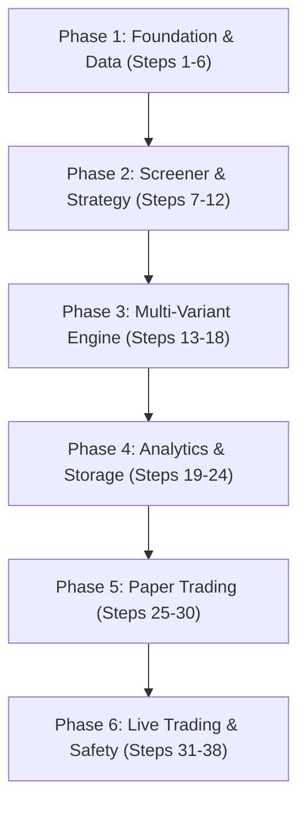

# Dhan F&O Algo Trading System — Project Plan (Plan.MD)

> **Document Version**: 1.0  
> **Source Conversation ID**: `c355fd7e-9595-49af-925c-37e1f7fc246b`  
> **Date**: 2026-09-30  
> **Status**: Approved System Architecture & Master Plan

---

## 📌 Executive Summary & System Goals

The **Dhan F&O Algo Trading System** is an enterprise-grade, modular Python algorithmic trading framework specifically designed for Indian Derivatives Markets (NSE Equity F&O, NIFTY, BANKNIFTY, FINNIFTY) via the **Dhan API v2**.

The system addresses three critical trading needs:
1. **Multi-Variant Backtesting**: Single-pass backtesting across $N$ execution variants (capital sizing, stop-loss modes, partial profit targets, trailing stops) without repeating signal calculations or reloading historical data.
2. **Dual-Price Tracking (Spot vs. Option)**: Evaluating entry, SL, target, and trailing exits referenced independently against either the underlying spot price chart or the option contract premium chart.
3. **Dynamic Screener Engine**: Real-time screening across 208 F&O stocks at market open (e.g., Sector Losers + Open=High conditions at 09:16 AM) integrated seamlessly into backtesting, paper trading, and live execution with sub-500ms latency.

---

## 📊 Key Requirements & User Decisions Matrix

| Requirement Area | Specification / Decision | Rationale / Details |
|---|---|---|
| **Trade Universe** | 208 NSE F&O Stocks + Index F&O (NIFTY, BANKNIFTY, FINNIFTY) + Option Chains | Covers high-liquidity stock options and index options. |
| **Data Granularity** | 1-minute OHLCV candles | High-frequency intraday and positional granularity over 5 years. |
| **Data Provider** | Dhan API (Historical Candle API) | Primary broker API with fallback/resumable batch downloader. |
| **Backtest Mode** | Candle-by-candle (with Conservative OHLC intra-candle simulation) | Prevents look-ahead bias; worst-case SL hit if both SL and target occur in same candle. |
| **Paper Trading** | 3-Month simulated execution against live market WebSocket feeds | Mandatory forward-testing phase before live capital allocation. |
| **Live Trading** | Real-order placement via Dhan API v2 | Uses unified strategy logic; only execution adapter changes. |
| **Capital Allocation** | ₹1,000,000 to ₹10,000,000 (Flexible per variant) | Supports parallel evaluation of small vs large portfolio sizing. |
| **Multi-Variant Sizing** | Partial exits (T1, T2) + Trailing SL | Optimizes profit realization across multiple lots. |
| **Market Context** | India VIX + ATM Implied Volatility (BS Model) | Contextualizes strategy performance in low/high volatility regimes. |

---

## 🏗️ System Architecture & Core Innovations

### 1. Unified 3-Mode Execution Pattern
The core architectural principle dictates: **The Strategy & Screener logic remains identical across Backtest, Paper Trading, and Live Execution.** Only the `ExecutionAdapter` changes.

```
                    ┌──────────────────────────────────┐
                    │    Strategy Engine & Screener    │
                    └────────────────┬─────────────────┘
                                     │
           ┌─────────────────────────┼─────────────────────────┐
           ▼                         ▼                         ▼
┌────────────────────┐    ┌────────────────────┐    ┌────────────────────┐
│ Backtest Adapter   │    │ Paper Trade        │    │ Live Dhan Adapter  │
│ (Historical Data)  │    │ (Live WS Stream)   │    │ (Broker Orders)    │
└────────────────────┘    └────────────────────┘    └────────────────────┘
```

### 2. Multi-Variant Parallel Universes (Single-Pass Backtesting)
When a strategy produces a single BUY/SELL signal, the system spawns $N$ parallel execution variants simultaneously. This avoids running $N$ separate backtests.

```
                     [STRATEGY SIGNAL: BUY NIFTY 25000 CE @ ₹150]
                                          │
            ┌─────────────────────────────┼─────────────────────────────┐
            ▼                             ▼                             ▼
   [VARIANT 1: ₹1L]              [VARIANT 2: ₹5L]              [VARIANT 3: ₹10L]
   • 1 Lot                       • 3 Lots                      • 6 Lots
   • Fixed 20% Option SL         • Spot Level SL               • Indicator (VWAP) SL
   • Exit 100% at Target 1       • Partial 50% T1, 50% Trail    • Partial 33% T1/T2/Trail
```

### 3. Dual-Price Variant System (Spot vs. Option Premium)
Because option premiums diverge from underlying spot prices due to Greeks (Delta, Theta, Vega), every entry, stop-loss, and exit rule can reference either chart:

```
                          ┌──────────────────────────┐
                          │   UNDERLYING SPOT PRICE  │ (NIFTY Index / Stock)
                          └─────────────┬────────────┘
                                        │
             ┌──────────────────────────┴──────────────────────────┐
             ▼                                                     ▼
┌──────────────────────────┐                             ┌──────────────────────────┐
│ Spot-Referenced Entry/SL │                             │ Option Premium Entry/SL  │
│ e.g. Buy CE when spot >  │                             │ e.g. Buy CE on premium   │
│ VWAP; SL when spot < O   │                             │ dip; SL when premium -20%│
└──────────────────────────┘                             └──────────────────────────┘
```

### 4. Dynamic Screener Engine (Sub-500ms Latency Pipeline)
The screener evaluates the entire 208-stock universe dynamically at market open (e.g., 09:16:00 AM) to select candidates for trading.

```
[09:15:00] Market Open → 1st 1-min Candle Forms
[09:15:59] 1st Candle Closes
[09:16:00] Pipeline Execution (<500ms):
           ├── Ingest 208 stocks 1-min OHLC               (~50ms)
           ├── Rank Sectors by % Change                   (~10ms)
           ├── Filter Top 2 Loser Sectors                 (~5ms)
           ├── Filter Top 2 Loser Stocks in Sectors       (~5ms)
           ├── Check Open == High & Open == Low           (~2ms)
           ├── Select ATM/OTM Option Contract             (~50ms)
           └── Submit Order to Dhan API / Simulator       (~100-200ms)
```

---

## 🗄️ Database Schema (SQLite / DuckDB)

The logging engine records trade metrics across all variants for deep analytics.

```sql
-- 1. Master Backtest / Session Run
CREATE TABLE runs (
    run_id TEXT PRIMARY KEY,
    run_type TEXT CHECK(run_type IN ('BACKTEST', 'PAPER', 'LIVE')),
    strategy_name TEXT NOT NULL,
    start_time TIMESTAMP NOT NULL,
    end_time TIMESTAMP NOT NULL,
    config_json TEXT NOT NULL
);

-- 2. Base Trade Signals (Shared across variants)
CREATE TABLE trades (
    trade_id TEXT PRIMARY KEY,
    run_id TEXT REFERENCES runs(run_id),
    symbol TEXT NOT NULL,
    underlying_symbol TEXT NOT NULL,
    signal_type TEXT CHECK(signal_type IN ('BUY_CE', 'BUY_PE', 'SELL_CE', 'SELL_PE')),
    signal_time TIMESTAMP NOT NULL,
    spot_price_at_signal REAL NOT NULL,
    option_price_at_signal REAL NOT NULL,
    screener_metadata TEXT
);

-- 3. Variant Executions & Results
CREATE TABLE trade_variants (
    variant_trade_id TEXT PRIMARY KEY,
    trade_id TEXT REFERENCES trades(trade_id),
    variant_name TEXT NOT NULL,
    capital_allocated REAL NOT NULL,
    quantity INTEGER NOT NULL,
    entry_time TIMESTAMP NOT NULL,
    entry_spot_price REAL NOT NULL,
    entry_option_price REAL NOT NULL,
    exit_time TIMESTAMP,
    exit_spot_price REAL,
    exit_option_price REAL,
    exit_reason TEXT CHECK(exit_reason IN ('TARGET_1', 'TARGET_2', 'SL_SPOT', 'SL_OPTION', 'SL_INDICATOR', 'SQUARE_OFF')),
    pnl REAL,
    pnl_percentage REAL,
    max_favorable_excursion REAL,
    max_adverse_excursion REAL
);

-- 4. Market Context (VIX, IV, Greeks)
CREATE TABLE market_context (
    context_id TEXT PRIMARY KEY,
    trade_id TEXT REFERENCES trades(trade_id),
    india_vix REAL,
    stock_atm_iv REAL,
    delta REAL,
    gamma REAL,
    theta REAL,
    vega REAL
);
```

---

## 📁 Directory & File Structure

```
dhan-fo-algo-trading/
├── Plan.MD                       # Master Architecture & Build Plan (This File)
├── config/
│   ├── config.yaml               # Broker credentials, data paths, global settings
│   ├── instruments.json          # Security ID mapping for Dhan API
│   └── variants_config.yaml      # Multi-variant parameter grid definitions
├── data/
│   ├── raw/                      # Downloaded CSVs / Raw API JSON responses
│   ├── processed/                # Cleaned Parquet files (partitioned by symbol/year)
│   └── sector_mapping.json       # Sector classification for 208 F&O stocks
├── src/
│   ├── __init__.py
│   ├── data_pipeline/
│   │   ├── downloader.py         # Resumable Dhan API 5-year candle downloader
│   │   ├── loader.py             # High-performance Parquet candle loader
│   │   └── cleaner.py            # Corporate action / missing candle fixer
│   ├── screener/
│   │   ├── base_screener.py      # Abstract Screener Interface
│   │   ├── sector_loser.py       # Sector Loser + Stock Loser Screener
│   │   └── open_high_low.py      # Open=High / Open=Low Screener
│   ├── strategy/
│   │   ├── base_strategy.py      # Abstract Strategy Interface
│   │   ├── open_high_put.py      # Open=High Option Buying Strategy
│   │   └── ema_crossover.py      # Dual EMA Trend Following Strategy
│   ├── engine/
│   │   ├── multi_variant.py      # Parallel Multi-Variant Execution Engine
│   │   ├── simulator.py          # OHLC Order Simulator (Slippage & Brokerage)
│   │   └── portfolio.py          # Multi-Lot Sizing & Position Manager
│   ├── paper/
│   │   ├── paper_engine.py       # Simulated Live Engine on WebSocket Feed
│   │   └── feed_handler.py       # Dhan Live WebSocket Streamer
│   ├── live/
│   │   ├── live_engine.py        # Real-Money Trading Engine
│   │   ├── order_adapter.py      # Dhan API v2 Order Execution Adapter
│   │   └── safety_guard.py       # Kill Switch & Max Daily Loss Limit
│   ├── analytics/
│   │   ├── metrics.py            # Sharpe, Sortino, Max Drawdown, Win Rate
│   │   ├── variant_ranker.py     # Cross-variant optimization & comparison
│   │   └── reporter.py           # HTML / Streamlit Dashboard Report Generator
│   └── utils/
│       ├── vix_calc.py           # India VIX & Black-Scholes ATM IV Calculator
│       └── logger.py             # Structured SQLite / Loguru Logger
├── tests/
│   ├── test_downloader.py
│   ├── test_screener.py
│   ├── test_multi_variant.py
│   └── test_order_adapter.py
├── requirements.txt
└── main.py                       # CLI Entry Point for Backtest / Paper / Live
```

---

## 🛠️ 38-Step Incremental Build Order



### Phase 1: Foundation & Data Layer (Steps 1–6)
1. Initialize Python environment, project structure, and `config.yaml`.
2. Implement `dhanhq` SDK wrapper & authentication verification script.
3. Build `sector_mapping.json` for 208 F&O stocks.
4. Implement `downloader.py` with rate-limiting, retry logic, and batch handling (5-day intraday chunks).
5. Build `cleaner.py` to format OHLCV data into Parquet format.
6. Create `loader.py` for high-speed memory-mapped data ingestion.

### Phase 2: Screener & Strategy Framework (Steps 7–12)
7. Define `BaseScreener` abstract interface.
8. Implement `SectorLoserScreener` (Sector ranking + top loser stock filter).
9. Implement `OpenHighLowScreener` (Open=High check at 09:16 AM).
10. Define `BaseStrategy` abstract interface with `on_candle()`, `entry_rules()`, `exit_rules()`.
11. Implement `OpenHighPutStrategy` (Option buying on screened stocks).
12. Implement `EMACrossoverStrategy` for baseline testing.

### Phase 3: Multi-Variant Engine & Simulation (Steps 13–18)
13. Design `variants_config.yaml` grid parser.
14. Implement `OrderSimulator` with configurable slippage & STT/brokerage costs.
15. Build intra-candle conservative exit checker (worst-case SL assumption).
16. Implement `MultiVariantEngine` core loop (single signal $\rightarrow N$ trade states).
17. Build multi-lot partial profit taker logic (T1 exit $X\%$ lots, T2 exit $Y\%$ lots).
18. Build trailing stop-loss manager (Spot-referenced & Option-referenced).

### Phase 4: Context Recording & Analytics (Steps 19–24)
19. Implement Black-Scholes implied volatility calculator (`vix_calc.py`).
20. Set up SQLite Database schema and ORM models.
21. Build `Logger` to persist trades, variants, and market context per candle.
22. Implement `metrics.py` (Sharpe, Profit Factor, Max Drawdown, Expectancy).
23. Create `variant_ranker.py` to sort and identify optimal parameters.
24. Build HTML performance report generator.

### Phase 5: Paper Trading Engine (Steps 25–30)
25. Implement Dhan WebSocket tick streamer (`feed_handler.py`).
26. Build live candle aggregator (ticks $\rightarrow$ 1-minute candles).
27. Adapt `MultiVariantEngine` for real-time paper execution.
28. Implement shadow variant tracker (tracking non-selected variants during paper trading).
29. Build live paper trading dashboard CLI.
30. Execute 3-month paper trading validation phase.

### Phase 6: Live Trading, Safety & Production (Steps 31–38)
31. Build `DhanLiveExecutor` order manager for Dhan API v2.
32. Implement option contract lookup (selecting exact ATM/OTM strikes based on spot).
33. Build `SafetyGuard`: Max daily loss auto-kill-switch, circuit breaker check, position limits.
34. Implement Order Latency Tracker (<500ms enforcement).
35. Build Telegram alert bot for trade execution notifications.
36. Conduct end-to-end sandbox dry run.
37. Deploy system to cloud VPS / local trading terminal.
38. Go live with single selected winning variant from paper testing.

---

## ⚡ Performance & Latency Targets

- **Backtest Processing**: $> 100,000$ candles per second across 208 stocks.
- **Screener Execution**: $< 20$ milliseconds for 208-stock sector analysis.
- **Option Strike Resolution**: $< 50$ milliseconds.
- **Order Placement (Live)**: $< 200$ milliseconds end-to-end API response time.
- **Overall Signal-to-Order Latency**: $< 500$ milliseconds.

---

## 💡 Recommended Next Actions for Workspace Setup

1. Set the directory `C:\Users\chand\.gemini\antigravity\scratch\dhan-fo-algo-trading` as your active workspace.
2. Ensure Python 3.10+ environment is installed with `pandas`, `polars`, `pyarrow`, `dhanhq`, `scipy`, `sqlite3`, and `streamlit`.
3. Proceed to **Phase 1, Step 1** of the build order.
