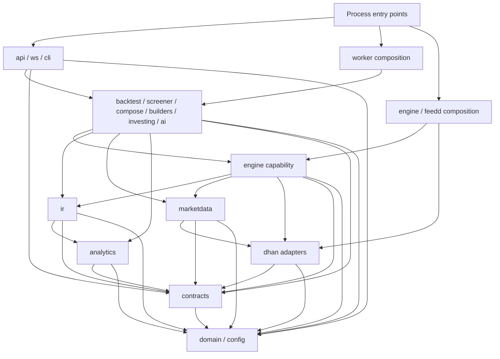

# Module and Dependency Map

## Purpose

This map freezes names, ownership, and allowed dependency direction before package scaffolding. Arrows below mean “may depend on” for code dependencies. Data flow is documented separately and does not permit importing another process entry point.

## Repository map

```text
frontend/                      @shreenexa/frontend
  src/                         browser-only React/TypeScript code

backend/                       shreenexa-backend
  app/                         Python import root
    contracts/                 versioned commands/events and ports
    domain/                    dependency-light domain value types
    config.py                  validated settings contract
    analytics/                 indicators and option analytics
    ir/                        StrategyIR schema/compiler/evaluators
    dhan/                      Dhan REST/feed/order adapters
    marketdata/                calendars, warehouse, backfill, universe
    engine/                    clock/data/broker/portfolio/risk/runtime
    backtest/                  simulation runner, metrics, optimization
    screener/                  point-in-time screening and scheduling
    compose/                   multi-strategy and regime composition
    builders/                  stock/option authoring services
    investing/                 holdings and long-term analytics
    ai/                        disabled/mock provider and later authoring boundary
    api/                       REST routers/application services
    ws/                        browser WebSocket delivery
    cli/                       management delivery

build/                         manifest/state/prompts/reports/orchestration
config/                        reviewed runtime/domain configuration
infra/                         local and production infrastructure
```

Files are introduced by their owning feature; this map is not authorization to scaffold later-feature modules early.

## Allowed code-dependency DAG



`frontend` depends only on versioned HTTP/WebSocket contracts exposed by `api`; it has no Python import edge. `build` is repository tooling and may run documented repository commands, but runtime packages do not import its orchestration implementation.

## Topological proof

One valid bottom-up ordering is:

1. `app.domain`
2. `app.contracts`, `app.config`
3. `app.analytics`, `app.dhan`
4. `app.ir`, `app.marketdata`
5. `app.engine`
6. `app.backtest`, `app.screener`, `app.compose`, `app.builders`, `app.investing`, `app.ai`
7. `app.api`, `app.ws`, `app.cli`
8. `api`, `engine`, `feedd`, and `worker` process entry points
9. `frontend` as an external contract consumer

Every allowed edge points from a later item to an earlier item. Therefore the declared code graph is acyclic.

## Forbidden edges

- Domain, contracts, analytics, IR, or market-data modules importing delivery or process entry points.
- Any process entry point importing another process entry point.
- `frontend` importing backend source or connecting directly to a storage engine.
- `engine` depending on `backtest`; simulation depends on engine contracts, not the reverse.
- `dhan` depending on engine, API, UI, or worker orchestration.
- Runtime packages importing the `build` orchestrator.
- Any source package importing from or executing the legacy project.

## Cross-process data flow

```text
Dhan market/depth WS -> feedd -> Redis hot state/pub-sub -> engine
                                                     \-> api -> browser WS -> frontend

frontend -> api -> Postgres commands/configuration
                -> Redis job queue -> worker -> Postgres results
                                           \-> Parquet partitions/manifests

Postgres deployment state + Redis market state -> engine
engine -> Postgres orders/fills/positions/checkpoints/audit
```

These arrows describe messages and storage, not code imports.

## Ownership and restart proof

| Resource or transition | Owner | Recovery source |
|---|---|---|
| Browser HTTP/WebSocket session | `api` | Client reconnect plus Postgres/Redis state |
| Dhan feed/depth connection and subscription | `feedd` | Configuration plus resubscription state |
| Paper/live strategy loop and execution transition | `engine` | Postgres checkpoint/order/fill/position state |
| Backfill/backtest/screener job | `worker` | Queue idempotency key plus Postgres job state |
| Historical partition publication | `worker` | Raw/provenance input and partition manifest |

Because `api` owns none of the execution-loop, feed-connection, or warehouse-write transitions, it can restart without taking ownership away from `engine`, `feedd`, or `worker`.

## Deferred decisions

- M0.3: exact data-root paths, raw-download immutability, warehouse versioning, backup boundary, and disk alarms.
- F0.1: dependency versions, lockfile tooling, test/lint/type commands, and workspace scripts.
- F0.2: container resource limits and service ports.
- F0.3: concrete process entry modules, supervisor implementation, heartbeat protocol, and health checks.
- F0.4+: settings schemas, secrets, transport payloads, and adapter implementations.
